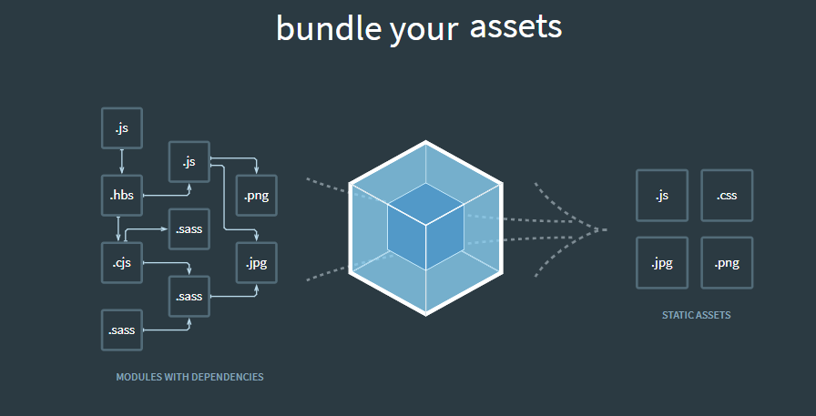
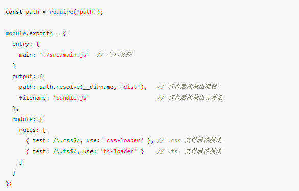
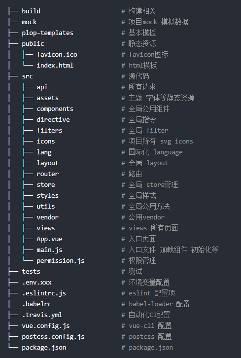
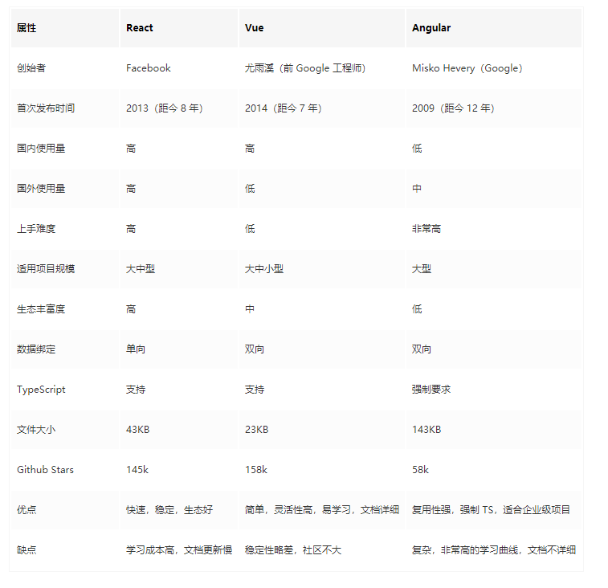

 >>> The only constant in the world is change
 
 10 年前，玩转前端就是精通 jQuery 和搞定 IE 浏览器兼容性

 jQuery 遭遇 “官方逼死同人” 逐渐退出历史舞台（元素选择和操作被标准的 DOM API 所统一）

 饱为诟病的 IE 浏览器兼容性问题，因为 IE 市场的逐渐萎缩以及一些兼容性工具（Polyfill）的出现，让其从之前的核心优化问题降级为如今的瘙痒问题，不再成为前端工程师的标配

 Webpack、Babel、Node.js、NPM/Yarn、ES6/7、React/Vue、Sass/Less、TypeScript、ESLint、Canvas/SVG 等现代化前端知识，就难以让人信服自己的专业背景。2021 年的前端工程师可能是真正意义上的工程师（Engineer）

## 打包部署
现代前端开发跟 10 年前最大的不同点是什么 -- 打包部署

如今的前端项目需要编译（Compile）

以前的大部分 Web UI 是通过 MVC 的方式来提供给用户的，前端页面大部分是通过后端模版渲染生成静态资源（HTML/CSS/JS）不经任何加工提供给浏览器的，静态资源相当于后端服务表现层（Presentation Layer）的一部分，复杂的交互通常都由后端来完成，因此前端静态资源通常非常简单，不需要经过复杂的编译打包，最多就是压缩（Minify）成更小的文件。

传统的 MVC 模式受限于网络传输，通常需要几百毫秒甚至更多来完成一次页面导航，而这是非常影响用户体验的 --- 前后分离  ---强大的打包和编译工具 ---Webpack 

webpaclk配合编译工具（babel），将各种类型的项目源代码文件（例如 .vue、.ts、.tsx、.sass）打包成原生的 .js、.css、.html 等静态文件

Webpack 通过检查源代码文件的各种依赖关系，分析编译后生成对应的静态资源文件。这就跟编译 Java、C# 代码编译是一个道理。

定义入口，输出，编译所用到的加载规则（Rules），项目根目录下执行 webpack 命令，就会默认加载该配置文件，然后读取源代码并打包为编译后的静态文件

`module.rules`定义各种文件类型的加载器（Loaders）--css-loader --ts-loader 强大的扩展性

Webpack 以及其他打包工具的驱动引擎是 Node.js

## 模块化

模块化（Moduarization）是任何技术工程项目中非常重要的概念。一个复杂的稳定运行的大型系统通常是由多个子模块一起构成的，它们之间相互通信、共同协作来完成一些非常复杂的逻辑或任务。

系统成长到一定规模，要增加单位规模所需要的花费成本会指数增加，麻烦是非线性的。做法：减少复杂性和可理解性--分而治之（模块化）

模块化让各个负责相同或类似功能的子系统独立运行（高内聚），并适当开放一些接口提供给其他子模块（低耦合）

整个大型系统由多个子模块描述，而这些子模块都有各自的特性和功能，让维护人员能够准确的定位到各功能对应的模块，从而大大减少了维护成本。

##### “高内聚，低耦合” 是模块化的核心理念，其最终的目的，是降低系统复杂性和提高可维护性。模块化对于日渐复杂而且动辄几百兆代码的前端项目来说，是非常非常重要的。

### NPM 前端项目构建工具

node.js的包管理工具，类似java的maven，ptyhon的pip，c#的nuget，软件工程所提倡的DRY原则（dont repeat yourself），对于已经存在的模块或功能，无需从头开始编写，重复造轮子。

NPM 就是前端项目中的依赖管理工具，它能够安装构建前端项目所需要的包和库，然后再通过前文的 Wepback 等打包工具将源代码编译成原生前端静态文件。

描述前端项目依赖的配置文件叫做 package.json，类似于 Python 中的 setup.py，Java 里的 pom.xml，可以定义项目的依赖包、运行入口、环境要求等等。package.json 可以手动生成。

### 项目结构 微观层面项目内的模块化

为了保证前端项目代码的可维护性，通常需要掌握清晰而合理的代码组织方式，包括如何对不同类型文件或组件进行分类和管理，以及如何组织项目目录的层次和结构。

可以理解为核心代码都在 src目录下，src下的子目录是前端项目的核心模块，页面（Views）、路由（Router）、组件（Components）、布局（Layouts）、状态管理（Store）等

组件一般是可复用的，是页面的组成部分；路由是实现前端导航匹配页面的功能；页面就是各种网页的实际内容。<strong>开发者可以通过对所要解决的问题进行分类，从而能够精确的定位到相关的模块，快速完成开发任务或解决疑难问题</strong>

## 前端框架

### jQuery（石器时代）

2006年-jquery，解决当时用原生方法操作 DOM 的痛点。jQuery 通过简洁的 API 和高效的性能，成为当时前端界的标配，成功，是建立在当时原生 JavaScript 的缺陷上：啰嗦而臃肿的语法，复杂而难以理解的设计模式，浏览器标准的不统一，Bootstrap，也是建立在 jQuery 上的。

jQuery的不足：
1. 用户体验，将原本一些后端的交互逻辑迁移到前端，以追求更快的响应速度和更流畅的用户体验，通过 Ajax 异步请求来实时渲染前端页面，也就是用 JS 代码来操作 DOM，jQuery 实现带有复杂交互逻辑的 UI 是一件非常头疼的事情。
2. jQuery 严重依赖于 DOM 元素的 CSS 或 XPath 选择器，这为项目模块化带来了非常大的麻烦：所有的元素对于一个前端应用来说几乎是全局，这意味着 class、id 等属性对于项目稳定性来说变得异常敏感，因为稍不注意你可能就误改了不该修改的元素，污染了整个应用。
3. jQuery 实现前端交互的原理是直接操作 DOM，这对于简单应用来说还好，但如果前端界面有大量需要渲染的数据或内容，或者要求频繁的改变界面的样式，这将产生非常大的性能问题，将导致浏览器卡顿，严重影响用户体验。
4. jQuery 没有一个编写前端项目的统一模式，程序员们可以根据自己的喜好随意发挥，这个也是造成前端应用 Bug 横飞的原因之一。

##### 大量使用 jQuery 来实现前端交互使前端项目变得非常脆弱（Fragile）

### AngularJS

2009年-google-angularjs，1,500 行 AngularJS 代码在 2 周内实现了 3 人 花了 6 个月开发的 17,000 行代码的内部项目，AngularJS 的主要特点是 HTML 视图（HTML View）与数据模型（Data Model）的双向绑定（Two-way Binding），这种编写模式不再要求主动更新 DOM，从而将节省大量主动操作 DOM 的代码和逻辑，这些 AngularJS 全部帮你自动完成了。下面是 AnguarJS 双向绑定的示意图

### React
2013-fackbook-react，创造了虚拟 DOM（Virtual DOM）的概念，巧妙的解决了前端渲染的性能问题；同时，React 对组件化支持得非常到位。React 的数据-视图单向绑定（One-way Binding）很好的解决了一致性问题，也非常好的支持 TypeScript，这能够为开发大型前端项目带来稳定性和健壮性，需要理解大量基础概念，如jsx

### vue
2014-前google-vue，在吸收 React 与 AngularJS 优点的同时，也做了一些优秀的创新。Vue 把视图（HTML）、数据模型（JS）和样式（CSS）整合到一个 .vue 文件中，并沿用 AngularJS 的双向绑定，这降低了前端开发的门槛，vue3支持ts

## 组件化  前端工程中的核心概念

组件化实际上是前端 UI 界面的模块化，如按钮、导航、输入框等，都是可以复用的 UI 模块，组件嵌套，界面的组织非常灵活，面对需求变更时，如布局，样式，功能扩展，从容不迫。

实现一个大型的扩展性强的前端项目，需要提前组织好代码结构（布局、组件、路由），需要考虑设计一些基础组件，简化后续的开发与维护工作

最基础的组件应该算是布局组件（Layout Components），顶部（Header）、侧边栏（Sidebar）、主容器（Main Container）以及底部（Footer）等等

用的功能组件也需要考虑，例如输入框（Input）、表单（Form）、弹出框（Modal）等等

<strong>避免重复造轮子</strong>

## 类型约束

2012-ts,可以利用静态代码检测机制将 JavaScript 用强类型约束起来。TypeScript 是 JavaScript 的超集，也就是说，TS 包含 JS 的全部语法和特性，并且在此基础上加入了类（Class）、接口（Interface）、装饰器（Decorators）、命名空间（Namespace）等面向对象编程（OOP）的概念

主要特点就是类型系统，它通过加入类型来扩展 JavaScript,静态类型的优势：可预测性，健壮性，稳定性。通过编译，TS 代码可以转化为原生的 JS 代码，因此在浏览器兼容性上，TS 代码没有任何问题。

## 其他
1. 代码风格约束。帮助统一代码风格，例如 ESLint。
2. 单元测试。有效的避免 Bug，工具包括 Jest、Mocha 等。
3. 多项目管理。拆分大型项目为不同的子项目或模块，帮助管理多模块项目，代表工具有 Lerna。
4. 项目部署。CI/CD、Nginx 等。